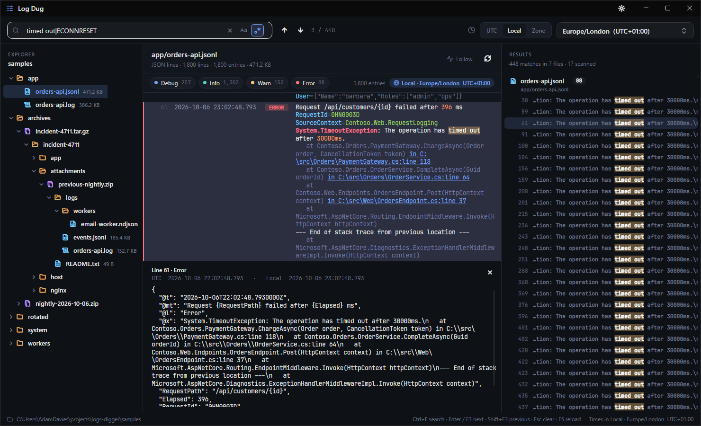

# Log Dug

A desktop log browser written in F#. Point it at a folder and it shows a file tree on the left, the selected log on the right, and a search bar that searches every file, including files inside `.zip`, `.tar.gz`, `.tgz` and `.gz` archives (nested archives too).



## Features

- **File tree** of the current directory (or a folder passed on the command line). Zip and tar.gz archives expand like folders, and gzipped files open as text.
- **Log viewer** with colour-coded levels, a level filter, syntax colouring for strings, numbers, keys, exceptions, links and stack frames, and line wrapping. Stack traces and other unmarked lines stay with the entry above them.
- **JSON lines** (Serilog compact `@t/@mt/@l/@x`, pino/bunyan numeric levels, and common `timestamp/level/message` keys) render as a message plus `key=value` properties. The detail pane shows the pretty-printed JSON.
- **Search everything** in plain text or regex mode, with optional match case. Results stream in per file and are grouped by file. Click a result, or press Enter/F3, to open the file, expand the tree to it, and select the matching entry.
- **Time display** in UTC, the OS local zone, or a target zone chosen from a list. The active zone is always shown above the log, and the detail pane shows UTC, local and target times for the selected entry. Timestamps without an offset are treated as UTC.
- **Follow** reloads the open file when it changes on disk and keeps the newest entries in view, like `tail -f`.
- Light and dark themes. Settings persist in `%APPDATA%\LogDug\settings.json`.
- NativeAOT: `dotnet publish` produces a single self-contained native executable.

## Install

Download a build from [Releases](https://github.com/adz/logdug/releases):

- `logdug-X.Y.Z-setup-x64.exe`: Windows installer (per user, adds `logdug` to PATH)
- `logdug-X.Y.Z-win-x64.zip`: portable Windows build
- `logdug-X.Y.Z-linux-x64.tar.gz`, `-osx-x64.tar.gz`, `-osx-arm64.tar.gz`

Each is a single NativeAOT executable plus its native graphics libraries. Run `logdug [folder]`. See [dev-docs/ReleaseProcess.md](dev-docs/ReleaseProcess.md) for how releases are built.

## Run from source

```sh
dotnet fsi scripts/make-samples.fsx      # optional: generate ./samples
dotnet run --project src/LogDug -- samples
```

With no argument the app browses the current directory.

Keys: `Ctrl+F` search, `Enter`/`F3` next match, `Shift+Enter`/`Shift+F3` previous, `Esc` clear, `F5` reload the open file.

## Test

```sh
dotnet test --project tests/LogDug.Tests
```

The suite includes a headless Avalonia scenario that drives the real window and writes `docs/screenshots/*.png`.

## Publish (NativeAOT)

```sh
bash scripts/publish-logdug.sh            # host platform, into artifacts/publish/logdug
artifacts/publish/logdug/logdug --self-test
artifacts/publish/logdug/logdug samples --search "heap out of memory" --snapshot shot.png
```

`--self-test` runs end-to-end checks without a window and reports through its exit code; CI and the release workflow run it on every shipped binary.

`--snapshot <png>` renders the window to a file and exits, so you can check a native build without a screen. On Windows the native linker needs the MSVC build tools; the publish script finds them through `vswhere`.

See [docs/GUIDE.md](docs/GUIDE.md) for a tour of the code.
